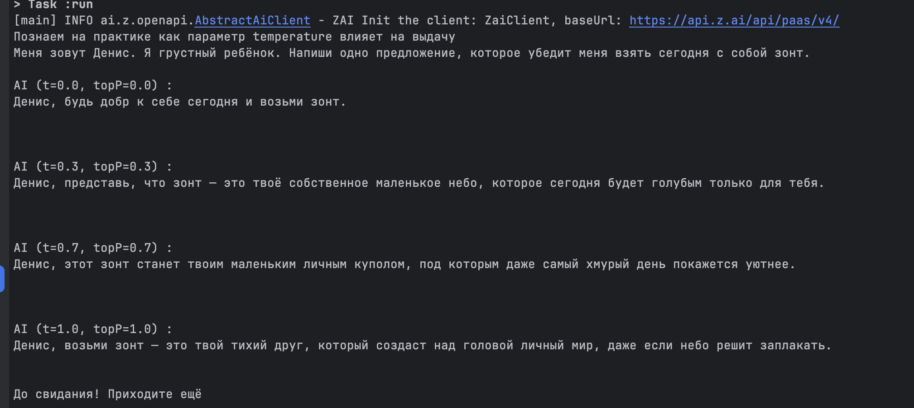
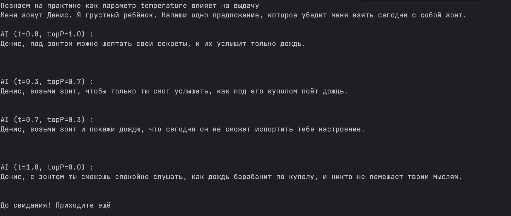

# Day 3

## Как параметр Temperature влияет на выдачу LLM модели.

__Temperature__ контролирует уровень случайности и креативности в ответах модели.
Чем ниже _t_, тем строже ответ. Строго соответствует критериям запроса.
Чем выше _t_, тем креативнее ответ.

 - _t_=[0.1-0.3] - Ответ очень предсказуемый, структурированный и безопасный.
   Используется для фактологических ответов, программирования, summarization, технической документации.

 - _t_=[0.5 - 0.8] - Баланс между креативностью и строгостью. Это "золотая середина".

 - _t_=[0.9 - 1.2+] - Максимальная креативность и неожиданность.
   Используется для поэзии, генерации идей, мозгового штурма, написания художественных текстов и т.п

 - _t_=0 модель всегда выбирает самое вероятное слово на каждом шаге.

Часто _t_ используется вместе с другим параметром — _top-p_.
__Top-p__ ограничивает выбор слов не всем словарем, а только теми, чьи вероятности в сумме дают _p_.
Например, _top-p_=0.9 означает что рассматриваются для выбора только топ-90% самых вероятных слов.

### Таким образом:
- Для фактологических задач: Низкий t (0.2) и низкий top-p (0.1).
- Для креативных задач: высокий t (0.9) и высокий top-p (0.9).

### Примеры выдачи Z.ai

