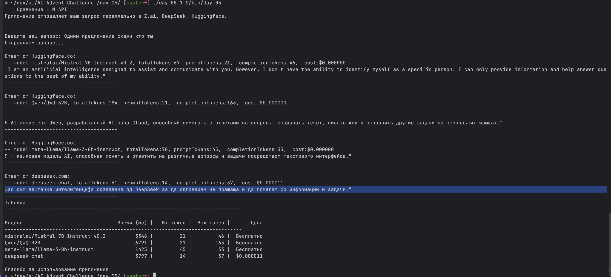

# LLM API Comparison Tool

Консольное приложение на Kotlin для сравнения ответов от двух LLM API: Z.ai, DeepSeek и Huggingface

1. Запустите приложение
2. Введите ваш запрос в терминал
3. Дождитесь получения ответов от обоих API
4. Сравните результаты

## Пример вывода

